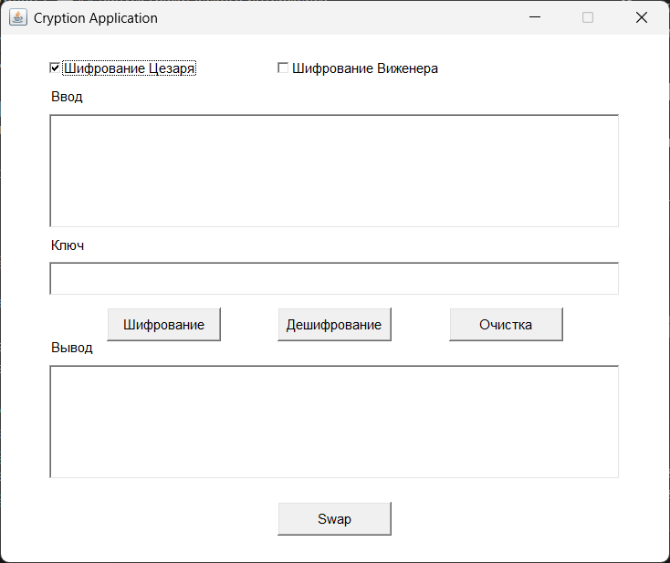

# Cryption

Cryption — это Java-приложение для шифрования и дешифрования текста с использованием шифров Цезаря и Виженера, предназначенное для работы с кириллическим алфавитом (на казахском языке). 

## Оглавление

- [Описание](#описание)
- [Требования](#требования)
- [Установка](#установка)
- [Использование](#использование)
- [Интерфейс приложения](#интерфейс-приложения)
- [Пример кода](#пример-кода)
- [Сборка проекта](#сборка-проекта)

## Описание

Cryption поддерживает два метода шифрования:

- **Шифр Цезаря**: Сдвигает символы текста на указанное число позиций.
- **Шифр Виженера**: Использует строку-ключ для шифрования, работая с каждым символом текста.

## Требования

- Java 8+
- Maven 3.2+

## Установка

1. Клонируйте репозиторий:
   ```bash
   git clone <URL репозитория>
   cd Cryption

   ```
2. Соберите проект с помощью Maven:
    ```bash
    mvn clean install package
    ```
## Использование

Приложение предоставляет методы encrypt и decrypt в классах CaesarCipher и VigenereCipher для работы с текстом и ключами шифрования.
- **Шифр Цезаря:** используйте числовой ключ (например, 3).
- **Шифр Виженера:** используйте строку на кириллице (например, "ключ").

## Интерфейс приложения


Интерфейс программы содержит:
- **Чекбоксы для выбора шифра** (Цезаря или Виженера).
- **Поля ввода для текста и ключа.**
- **Кнопки "Шифрование" и "Дешифрование"** для выполнения операций.
- **Кнопка "Очистка" для сброса полей и кнопка "Swap"** для обмена текстом между полями ввода и вывода.

## Запуск графического интерфейса
Чтобы запустить интерфейс, используйте команду:
```bash
java -jar Cryption-1.0-SNAPSHOT.jar
```
or
```bash
java -jar target\Cryption-1.0-SNAPSHOT.jar
```
## Пример кода
```java
import kz.bibarys.cryption.CaesarCipher;
import kz.bibarys.cryption.VigenereCipher;

public class MainExample {
    public static void main(String[] args) {
        String text = "Пример текста";
        int caesarKey = 3;
        String vigenereKey = "ключ";

        System.out.println("Цезарь шифрование: " + CaesarCipher.encrypt(text, caesarKey));
        System.out.println("Виженер шифрование: " + VigenereCipher.encrypt(text, vigenereKey));
    }
}
```
## Сборка проекта
Для создания JAR-файла используйте:
```bash
mvn clean package
```